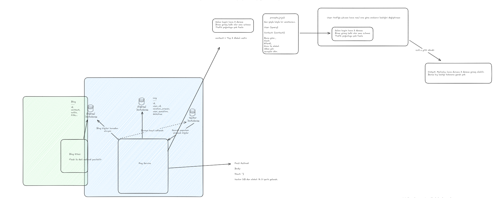

# Blog Arama Uygulaması

Bu proje, FastAPI, Milvus, MSSQL, ve Transformers kullanarak blogların aranmasını sağlayan bir uygulamadır. Uygulama, blog içeriklerini gömme (embedding) vektörlerine çevirerek Milvus vektör veritabanına ekler ve bu veriler üzerinde en yakın komşu (KNN) araması yapar.

## Özellikler
- MSSQL veritabanına blog ekleme, güncelleme ve silme.
- Milvus ile blog verilerini gömme vektörleri ile arama.
- FastAPI tabanlı web arayüzü ve API.

